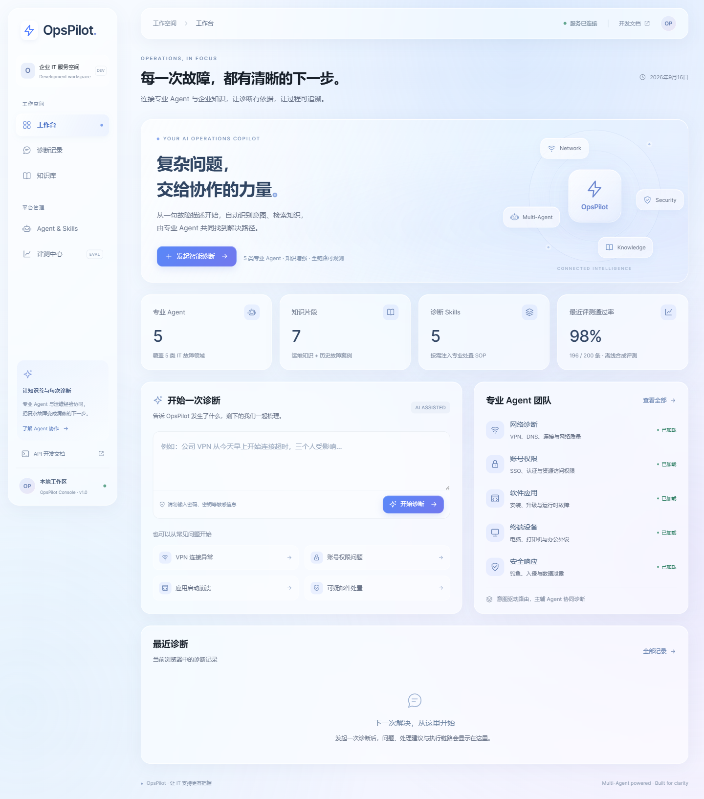
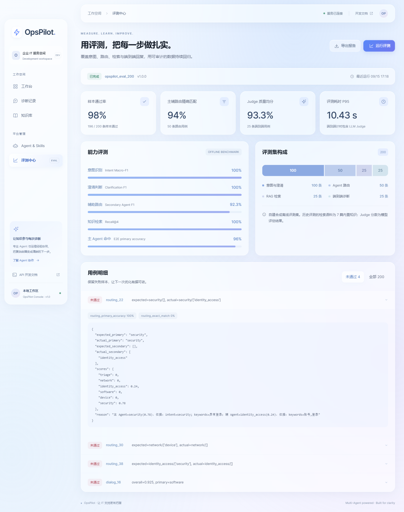
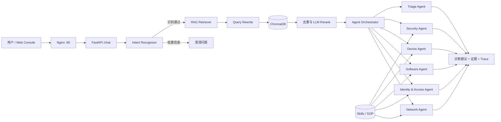

# OpsPilot 企业 IT 服务智能诊断 Agent 平台

OpsPilot 面向企业内部 IT 服务与故障处置场景，将用户的一段自然语言故障描述，转换为一条可检索、可路由、可解释、可评测的诊断链路。

项目采用显式编排方式实现 Agent 系统：先识别意图、实体和紧急程度，再检索运维知识与历史案例，随后选择主 Agent 和辅 Agent，动态注入对应诊断 Skill，最终返回诊断建议、证据来源、路由原因和完整调用链路。


## 项目展示

### 工作台



### 智能诊断



## 核心能力

- **细粒度意图识别**：融合 LLM Few-shot、Embedding 相似度和关键词 Pattern，识别故障类别、实体、紧急程度与置信度。
- **低置信度澄清**：当信息不足时暂停专业 Agent 路由，先向用户追问，降低误路由风险。
- **RAG 检索增强**：从症状、可能依赖和验证方式等角度改写 Query，并行检索运维知识和历史案例。
- **Multi-Agent 路由**：根据意图、关键词、实体和上下文动态评分，支持主 Agent 与一个辅 Agent 协同诊断。
- **动态 Skills 注入**：只向匹配的 Agent 注入对应诊断规范、验证步骤、安全限制和升级条件。
- **过程可观测**：返回 `routing_reason`、`rewritten_queries`、`agent_trace` 和请求耗时。
- **自动回归评测**：覆盖 Intent、Routing、RAG 和端到端回复，并使用 LLM-as-a-Judge 评价回复质量。
- **可视化控制台**：提供工作台、智能诊断、历史记录、知识库、Agent & Skills 和评测中心。

## 系统架构



## 一次请求的主链路

```text
POST /chat
  1. IntentRecognizer
     识别 intent、entities、urgency、confidence
  2. Low-confidence Guard
     信息不足时直接澄清，不进入专业 Agent
  3. RAGRetriever
     Query Rewrite → 并行召回 → 去重 → LLM Rerank
  4. AgentOrchestrator
     动态计算各 Agent 分数，选择主 Agent 和辅 Agent
  5. SkillManager
     按 Agent 类型与关键词注入对应诊断 SOP
  6. Agent Execution
     并行执行主辅 Agent，失败时由 Triage Agent 兜底
  7. ChatResponse
     返回诊断建议、路由原因、知识使用情况和 Agent Trace
```

这个项目既是 **Agent 项目**，也是一个 **结构化工作流**。Agent 负责专业推理与诊断，工作流负责约束执行顺序、失败处理和可观测输出。它没有让 LLM 完全自由地决定下一步，因此更适合对安全性、稳定性和审计能力有要求的企业 IT 场景。

## 核心模块设计

### 1. 意图识别

`core/intent_recognizer.py` 并行执行三种识别策略：

| 信号 | 默认权重 | 作用 |
| --- | ---: | --- |
| LLM Few-shot | 0.65 | 理解语义，抽取实体和紧急程度 |
| Embedding | 0.25 | 计算用户问题与领域样例的相似度 |
| Keyword Pattern | 0.10 | 为 VPN、DNS、401、蓝屏等领域词提供稳定信号 |

默认澄清阈值为 `0.55`。当融合置信度低于阈值且不是安全事件时，系统暂停专业 Agent 路由并返回澄清问题。

LLM 不可用时，系统退化为 Embedding 与 Pattern 融合，权重分别为 `0.65` 和 `0.35`。

### 2. RAG 检索

`rag/retriever.py` 的检索链路为：

1. 保留原始 Query，并从症状、可能依赖和验证方式等角度生成最多 3 个改写 Query。
2. 对所有 Query 并行检索 `knowledge` 和 `incident` 两类 ChromaDB Collection。
3. 按内容哈希去重，相同内容只保留分数更高的结果。
4. 候选数量超过 `top_k` 时调用 LLM Rerank。
5. 默认向 Agent 注入前 4 条证据。

知识库启动时会写入 4 篇运维知识和 3 篇历史案例，便于项目开箱演示。实际使用时可通过接口添加或上传 `.txt`、`.md` 文档。

### 3. Multi-Agent 路由

`agents/agent_orchestrator.py` 根据以下信号给 Agent 动态评分：

| 路由信号 | 分值 |
| --- | ---: |
| Intent 映射 | 0.60 |
| 关键词命中 | 最高 0.35 |
| 实体命中 | 0.15 |

分数最高的 Agent 成为主 Agent；其他非 Triage Agent 的分数达到 `0.18` 时，可选择其中分数最高的一个作为辅 Agent。

当前包含 5 个专业 Agent：

- `network`：VPN、DNS、Wi-Fi、代理、网关、延迟和丢包。
- `identity_access`：账号、SSO、MFA、认证、授权和权限。
- `software`：应用、操作系统、安装、升级、崩溃和运行错误。
- `device`：电脑、打印机、显示器、硬盘和外设。
- `security`：钓鱼、恶意软件、异常登录、入侵和数据泄露。

此外，`triage` 负责低置信度澄清和专业 Agent 全部失败后的兜底处理。

### 4. 动态 Skills

`core/skill_loader.py` 自动发现 `skills/*/SKILL.md`，根据以下条件选择需要注入的 Skill：

- Skill 已启用。
- 当前 Agent 类型与 Skill 声明的 `agents` 匹配。
- 用户消息命中 Skill 的领域关键词。

Skill 中保存诊断所需证据、排查步骤、验证方式、安全限制和升级条件。默认总注入长度上限为 `5000` 字符，避免无关 SOP 占用上下文。

### 5. 可观测输出

`POST /chat` 的关键返回变量：

| 字段 | 含义 |
| --- | --- |
| `intent` | 识别到的故障类别 |
| `confidence` | 融合意图置信度 |
| `urgency` | `low / medium / high / critical` |
| `entities` | IP、账号、软件、设备、网络服务等实体 |
| `primary_agent` | 主诊 Agent |
| `secondary_agents` | 辅助 Agent 列表，当前最多 1 个 |
| `clarification_required` | 是否需要用户补充信息 |
| `routing_reason` | Agent 评分与路由依据 |
| `rewritten_queries` | RAG 使用的原始与改写 Query |
| `knowledge_used` | 是否检索到并使用知识证据 |
| `agent_trace` | 意图、检索、路由和执行阶段的完整链路 |
| `latency_ms` | 后端完整处理耗时 |

## 为什么没有使用 LangChain

项目直接使用 Anthropic 兼容 SDK、FastAPI、ChromaDB 和自定义编排代码，没有依赖 LangChain。

这样设计的主要原因是：

- 路由规则、置信度阈值和失败处理都能在代码中直接定位。
- 请求、响应与 Agent Trace 的数据结构更加明确。
- 减少框架抽象，便于面试时解释每一步如何执行。
- 当前业务链路固定，自定义编排已经能够覆盖需求。

代价是需要自行维护 Prompt、并发、重试、状态传递和可观测逻辑。如果后续引入更复杂的循环规划、人工审批或持久化状态机，可以再评估 LangGraph 等框架。

## 技术栈

| 层级 | 技术 |
| --- | --- |
| 后端 | Python 3.12、FastAPI、Uvicorn、Pydantic |
| LLM | Anthropic SDK 与 Anthropic-compatible API |
| Agent | 自定义 IntentRecognizer、AgentOrchestrator、SkillManager |
| RAG | Query Rewrite、Embedding、ChromaDB、LLM Rerank |
| 前端 | 原生 JavaScript ES Modules、HTML、CSS |
| 部署 | Docker Compose、Nginx |
| 评测 | 自定义 Evaluator、LLM-as-a-Judge、Unittest、浏览器 QA |

## 快速启动

### 方式一：Docker Compose

前置条件：

- 已安装并启动 Docker Desktop。
- 已准备可用的 Anthropic 或 Anthropic-compatible 模型 API。

1. 创建环境变量文件：

```powershell
Copy-Item .env.example .env
```

2. 编辑 `.env`，至少配置：

```ini
ANTHROPIC_API_KEY=your-api-key
ANTHROPIC_BASE_URL=https://api.deepseek.com/anthropic
ANTHROPIC_MODEL=deepseek-v4-flash
```

3. 构建并启动服务：

```powershell
docker compose up -d --build
docker compose ps
```

首次构建会下载 Python 依赖和 ChromaDB 使用的 ONNX Embedding 模型，因此耗时会更长。

4. 访问服务：

- Web 控制台：<http://localhost/>
- Swagger API 文档：<http://localhost/docs>
- 健康检查：<http://localhost/health>
- ChromaDB：`localhost:8001`

5. 查看日志或停止服务：

```powershell
docker compose logs -f opspilot
docker compose down
```

如果重新创建后端容器后 Nginx 仍指向旧地址，可执行：

```powershell
docker compose restart nginx
```

### 方式二：本地 Python

```powershell
python -m venv .venv
.\.venv\Scripts\Activate.ps1
pip install -r requirements.txt
Copy-Item .env.example .env
python -m uvicorn api.main:app --host 0.0.0.0 --port 8000
```

本地模式默认使用：

```ini
CHROMA_MODE=local
CHROMA_PERSIST_DIRECTORY=./data/chroma
```

Docker Compose 会覆盖为 `CHROMA_MODE=server`，并连接独立的 `chromadb` 容器。

## 调用示例

### PowerShell

```powershell
$body = @{
    message = "公司 VPN 从今天早上开始连接超时，三个人受影响，本地网络正常"
    user_id = "demo-user"
} | ConvertTo-Json

Invoke-RestMethod `
    -Method Post `
    -Uri "http://localhost/chat" `
    -ContentType "application/json; charset=utf-8" `
    -Body $body
```

典型响应结构：

```json
{
  "request_id": "...",
  "response": "...",
  "intent": "network",
  "confidence": 0.896,
  "urgency": "high",
  "entities": {
    "network_service": ["vpn"]
  },
  "primary_agent": "network",
  "secondary_agents": [],
  "clarification_required": false,
  "routing_reason": "主 Agent=network(...)，依据：...",
  "agent_trace": [],
  "knowledge_used": true,
  "rewritten_queries": [],
  "escalated": false,
  "latency_ms": 0.0
}
```

响应中的数值只用于说明字段格式，实际结果由输入、模型和运行环境决定。

## API 一览

| 方法 | 路径 | 作用 |
| --- | --- | --- |
| `GET` | `/` | Web 控制台 |
| `GET` | `/health` | 服务、Agent 与知识库状态 |
| `POST` | `/chat` | 执行完整智能诊断链路 |
| `GET` | `/skills` | 查看 Skills 摘要 |
| `GET` | `/skills/{name}` | 查看指定 Skill 内容 |
| `POST` | `/skills/reload` | 重新加载 Skills |
| `GET` | `/knowledge/documents` | 浏览知识片段 |
| `GET` | `/knowledge/stats` | 查看知识库统计 |
| `POST` | `/knowledge/add` | 添加结构化知识 |
| `POST` | `/knowledge/upload` | 上传 `.txt` 或 `.md` 文件，最大 10 MB |
| `GET` | `/search` | 单独执行 RAG 检索 |
| `GET` | `/eval/latest` | 读取已保存评测，不触发模型调用 |
| `POST` | `/eval/run` | 运行快速或完整评测 |

## 自动评测

项目包含 200 条自建合成离线回归用例：

| 模块 | 用例数 | 评测目标 |
| --- | ---: | --- |
| Intent 与澄清 | 100 | 六类意图与低置信度澄清 |
| Agent Routing | 50 | 主 Agent 与辅 Agent 选择 |
| RAG | 25 | Recall@4 与首个相关结果排名 |
| 端到端对话 | 25 | 检索、路由、Agent 执行与 Judge 质量 |
| 合计 | 200 | 分层离线回归 |

2026-09-15 基于 `deepseek-v4-flash` 的一次实测结果：

| 指标 | 结果 |
| --- | ---: |
| 总用例通过率 | 196/200，98.0% |
| Intent Macro-F1 | 100.0% |
| Clarification F1 | 100.0% |
| 主辅 Agent 路由 Exact Match | 94.0% |
| Secondary Agent F1 | 92.31% |
| RAG Recall@4 / MRR | 100.0% / 100.0% |
| 端到端主 Agent 命中率 | 96.0% |
| LLM Judge 质量均分 | 93.30% |
| 端到端延迟 P50 / P95 | 8.27 s / 10.43 s |

完整报告见 [evaluation/results/opspilot_eval_200_20260915.md](evaluation/results/opspilot_eval_200_20260915.md)。

读取已保存评测不会产生模型调用：

```powershell
Invoke-RestMethod -Method Get -Uri "http://localhost/eval/latest"
```

运行完整 200 条评测会产生较多模型调用，并可能持续数分钟：

```powershell
Invoke-RestMethod `
    -Method Post `
    -Uri "http://localhost/eval/run" `
    -ContentType "application/json" `
    -Body '{"full_dataset":true}'
```

### 评测口径说明

- 数据集为固定、域内、自建合成数据，不包含真实企业工单。
- 当前检索语料只有 7 篇内置知识或案例，RAG 指标不能证明大规模知识库效果。
- LLM-as-a-Judge 是模型代理指标，不等同于人工验收结果。
- 面向生产环境的结论仍需要脱敏真实工单、人工标注和双盲评审。

## 测试与前端 QA

当前仓库验证结果：后端单元测试 `20/20` 通过，前端自动检查 `18/18` 通过。

运行后端单元测试：

```powershell
python -m unittest discover -s tests -v
```

安装浏览器 QA 依赖并运行离线检查：

```powershell
npm install --prefix tools/ui-qa
node tools/ui-qa/check.mjs
```

运行真实接口检查会触发少量模型调用：

```powershell
node tools/ui-qa/check.mjs --live
```

检查内容包括桌面与移动端布局、知识检索、Skills 详情、失败样本展开、输入转义和页面级横向溢出。结果与截图保存在 `tools/ui-qa/artifacts/`。

## 环境变量

| 变量 | 默认值 | 说明 |
| --- | --- | --- |
| `ANTHROPIC_API_KEY` | 无 | 模型 API Key，必填 |
| `ANTHROPIC_BASE_URL` | DeepSeek Anthropic-compatible 地址 | 模型服务地址 |
| `ANTHROPIC_MODEL` | `deepseek-v4-flash` | 模型名称 |
| `INTENT_CONFIDENCE_THRESHOLD` | `0.55` | 低置信度澄清阈值 |
| `CHROMA_MODE` | `local` | `local` 或 `server` |
| `CHROMA_HOST` | `localhost` | ChromaDB Server 地址 |
| `CHROMA_PORT` | `8001` | 本机映射端口；容器内由 Compose 覆盖为 `8000` |
| `CHROMA_PERSIST_DIRECTORY` | `./data/chroma` | 本地持久化目录 |
| `OPSPILOT_SKILLS_DIR` | `./skills` | Skills 根目录 |
| `OPSPILOT_SKILLS_MAX_PROMPT_CHARS` | `5000` | Skill 最大注入字符数 |
| `EVAL_DATASET_PATH` | `./evaluation/datasets/opspilot_eval_200.json` | 评测集路径 |
| `EVAL_CONCURRENCY` | `4` | 评测并发数 |

## 项目结构

```text
EchoMind/
├─ api/
│  └─ main.py                  # FastAPI 入口与主链路编排
├─ core/
│  ├─ intent_recognizer.py     # 三路融合意图识别
│  ├─ skill_loader.py          # 动态 Skill 加载与注入
│  └─ llm_utils.py             # LLM 响应与请求参数工具
├─ rag/
│  ├─ knowledge_base.py        # ChromaDB 存储、切分与检索
│  └─ retriever.py             # Query Rewrite、去重与 Rerank
├─ agents/
│  └─ agent_orchestrator.py    # 专业 Agent、动态路由与协同执行
├─ skills/                     # 五个领域诊断 SOP
├─ evaluation/
│  ├─ datasets/                # 200 条评测集
│  ├─ results/                 # 评测结果摘要
│  └─ evaluator.py             # 自动指标与 LLM-as-a-Judge
├─ frontend/                   # 液态玻璃风格 Web 控制台
├─ tests/                      # 后端单元测试
├─ tools/ui-qa/                # 浏览器自动检查与截图
├─ config/nginx/nginx.conf     # Nginx 反向代理与限流
├─ Dockerfile                  # Python 3.12 多阶段构建
└─ docker-compose.yml          # API、ChromaDB、Nginx 编排
```

## 常见问题

### 返回 `AuthenticationError`

检查 `.env` 中的 `ANTHROPIC_API_KEY`、`ANTHROPIC_BASE_URL` 和 `ANTHROPIC_MODEL` 是否与模型服务一致，然后重新创建后端容器：

```powershell
docker compose up -d --build --force-recreate opspilot
docker compose restart nginx
```

### Docker 中无法连接 ChromaDB

Docker Compose 已自动设置：

```ini
CHROMA_MODE=server
CHROMA_HOST=chromadb
CHROMA_PORT=8000
```

不要在容器内使用 `localhost:8001` 连接 ChromaDB；`8001` 是宿主机映射端口。

### 页面可以打开，但数据仍是旧状态

后端容器重新创建后，执行：

```powershell
docker compose restart nginx
```

### ChromaDB 出现 PostHog 参数错误

项目已经在 `requirements.txt` 中固定 `posthog<6.0.0`，以兼容 ChromaDB `0.5.23` 的遥测调用签名。

## 当前边界与下一步

当前版本已经打通从意图识别、RAG、Agent 路由、Skill 注入到自动评测的完整链路，但仍有以下边界：

- 知识库规模较小，尚未验证大规模文档下的召回、分块和索引策略。
- 评测集以合成数据为主，尚未引入脱敏真实工单。
- LLM Judge 尚未与人工双盲评审进行系统校准。
- 对话历史当前由客户端传入，未实现多用户服务端持久化。
- Agent 执行以诊断和建议为主，不直接进行高风险运维变更。

后续可以继续扩展真实工单评测、混合检索、人工审批节点、持久化会话和生产级鉴权审计。
